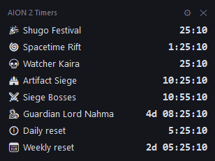
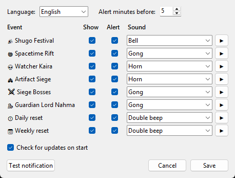

# A2Timers — AION 2 event timers overlay

[🇬🇧 English](#english) · [🇮🇹 Italiano](#italiano) · [🔒 Is it safe? / È sicuro?](#is-it-safe)



---

## English

A small always-on-top overlay for **AION 2** with live countdowns for recurring events, and a sound + Windows notification a few minutes before each one starts.

| Event | When (UTC) |
|---|---|
| Shugo Festival | every hour, 10 min |
| Spacetime Rift | every 3 h from 00:00, portal open 10 min |
| Watcher Kaira | every 3 h from 02:00 |
| Artifact Siege | Mon / Thu / Sat 21:00, 30 min |
| Siege Bosses | Mon / Thu / Sat 21:30, 30 min |
| Guardian Lord Nahma | Fri / Sun 19:00, 30 min |
| Daily reset | every day 16:00 |
| Weekly reset | Wed 16:00 |

Times are shown in your PC's local time zone.

### Features
- Transparent overlay, always on top of the game (use **borderless window** mode), drag it anywhere.
- Resize it with the **◢** corner grip or the *Size* slider (60–200%), and set its *Opacity* (20–100%).
- Row turns **orange** before an event and **green ("ACTIVE")** while it is running.
- Settings (⚙): choose which events to **show**, which ones **alert** you, a **sound per event** (built-in, Windows or your own `.wav`), alert lead time, language (English / Italian).
- Tells you when a new version is available.
- **Safe for your account:** it does not read the game's memory or network traffic — it only does clock math.

### Install
1. Download `A2Timers-Setup-x.y.z.exe` from [Releases](../../releases/latest).
2. Run it. Windows SmartScreen may say *"Windows protected your PC"* because the installer is not code-signed: click **More info → Run anyway**.
3. No administrator rights needed. Optional: desktop icon, start with Windows.

Uninstall from *Settings → Apps*. Your settings are kept in `%APPDATA%\A2Timers`.

### Custom schedules
If the game changes its schedule, put your own `events.json` in `%APPDATA%\A2Timers\` (copy the [default one](events.json) and edit it):

```json
{"id": "nahma", "name": "Guardian Lord Nahma", "icon": "🐉", "anchor_utc": "19:00",
 "weekdays": ["fri", "sun"], "duration_minutes": 30, "sound": "builtin:gong"}
```
- `anchor_utc` + `every_minutes` (must divide 1440) for repeating events, or `weekdays` for weekly ones.
- `name` can be a string or `{"it": "...", "en": "..."}`.

### Build from source
Requires Python 3.12+ and [Inno Setup 6](https://jrsoftware.org/isinfo.php).
```powershell
pip install -r requirements-dev.txt
python -m unittest discover -s tests -t .   # tests
python A2Timers.pyw                          # run from source
.\build.ps1                                  # -> dist\A2Timers-Setup-<version>.exe
```
Releases are built automatically by GitHub Actions when a `vX.Y.Z` tag is pushed (the tag must match `version.py`).

### Is it safe?
| | |
|---|---|
| **Game** | Never reads the game's memory, files or network traffic, and never sends input to it. It cannot get your account flagged: it only does clock math. |
| **Network** | One request at startup to `api.github.com` to check for a new version (turn it off in ⚙). Nothing else, no telemetry. |
| **Permissions** | Installs per user, **no administrator rights**. Writes only to its install folder and `%APPDATA%\A2Timers`. |
| **Source** | 100% open source (MIT): every line is in this repository. |
| **Build** | Every installer is built by **GitHub Actions** from the tagged source code — not on a private PC — and published with its **SHA-256** and a signed **build provenance attestation**. |

**Verify your download** (instructions also in every [release](../../releases/latest)):
```powershell
Get-FileHash .\A2Timers-Setup-x.y.z.exe          # must match the SHA-256 in the release notes
gh attestation verify .\A2Timers-Setup-x.y.z.exe --repo Gioxfight/A2Timers
```
The second command ([GitHub CLI](https://cli.github.com/)) proves the file was produced by this repository's release workflow from a specific commit.

**Why does Windows warn me?** SmartScreen shows *"Windows protected your PC"* for any installer that is not code-signed with a paid certificate and has few downloads yet — it is not a virus detection. Click **More info → Run anyway**.

---

## Italiano

Un piccolo overlay sempre in primo piano per **AION 2** con i countdown degli eventi ricorrenti, più un suono e una notifica di Windows qualche minuto prima che inizino.

Eventi: Shugo Festival, Spacetime Rift, Watcher Kaira, Artifact Siege, Siege Bosses, Guardian Lord Nahma, reset giornaliero e settimanale (orari nella tabella sopra, mostrati nel fuso orario del tuo PC).

### Funzioni
- Overlay trasparente sopra il gioco (usa la modalità **finestra senza bordi**), trascinabile.
- Grandezza regolabile con la maniglia **◢** nell'angolo o con il cursore *Grandezza* (60–200%), più il cursore *Opacità* (20–100%).
- La riga diventa **arancione** prima dell'evento e **verde ("ATTIVO")** mentre è in corso.
- Impostazioni (⚙): scegli quali eventi **mostrare**, quali **avvisare**, un **suono per ogni evento** (inclusi, di Windows o un tuo `.wav`), i minuti di anticipo e la lingua.
- Ti avvisa quando esce una nuova versione.
- **Nessun rischio per l'account:** non legge la memoria del gioco né il traffico di rete, fa solo calcoli sull'orologio.

### Installazione
1. Scarica `A2Timers-Setup-x.y.z.exe` da [Releases](../../releases/latest).
2. Avvialo. Windows SmartScreen potrebbe dire *"Windows ha protetto il PC"* perché l'installer non è firmato: clicca **Ulteriori informazioni → Esegui comunque**.
3. Non servono permessi di amministratore. Opzionali: icona sul desktop, avvio con Windows.

Si disinstalla da *Impostazioni → App*. Le impostazioni restano in `%APPDATA%\A2Timers`.

### È sicuro?
| | |
|---|---|
| **Gioco** | Non legge mai memoria, file o traffico di rete del gioco e non gli invia comandi. Non può farti segnalare l'account: fa solo calcoli sull'orologio. |
| **Rete** | Una sola richiesta all'avvio verso `api.github.com` per controllare se c'è una nuova versione (disattivabile in ⚙). Nient'altro, nessuna telemetria. |
| **Permessi** | Si installa per utente, **senza permessi di amministratore**. Scrive solo nella sua cartella e in `%APPDATA%\A2Timers`. |
| **Codice** | 100% open source (MIT): ogni riga è in questo repository. |
| **Build** | Ogni installer è costruito da **GitHub Actions** a partire dal codice pubblicato — non su un PC privato — e pubblicato con il suo **SHA-256** e un'**attestazione di provenienza** firmata. |

**Verifica il file scaricato** (istruzioni anche in ogni [release](../../releases/latest)):
```powershell
Get-FileHash .\A2Timers-Setup-x.y.z.exe          # deve coincidere con lo SHA-256 della release
gh attestation verify .\A2Timers-Setup-x.y.z.exe --repo Gioxfight/A2Timers
```
Il secondo comando ([GitHub CLI](https://cli.github.com/)) dimostra che il file è stato prodotto dal workflow di questo repository a partire da un commit preciso.

**Perché Windows mi avvisa?** SmartScreen mostra *"Windows ha protetto il PC"* per qualsiasi installer non firmato con un certificato a pagamento e con ancora pochi download: non è un rilevamento di virus. Clicca **Ulteriori informazioni → Esegui comunque**.

### Orari personalizzati
Se il gioco cambia gli orari, metti un tuo `events.json` in `%APPDATA%\A2Timers\` (copia [quello predefinito](events.json) e modificalo). Formato come nell'esempio sopra.

---

*A2Timers is a fan-made tool, not affiliated with or endorsed by NCSOFT. AION is a trademark of NCSOFT Corporation. Event schedules were cross-checked with [questlog.gg](https://questlog.gg/aion-2/en/server-status).*


